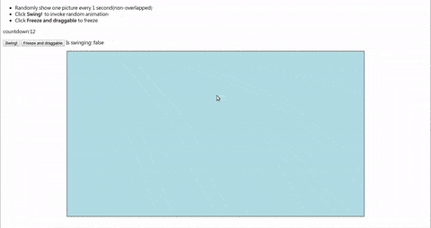

# vanillajs-demo

A small project using JavaScript without frameworks.

See [Demo page](http://hankchiutw.github.io/vanillajs-demo/).

## What's demostrated

* JavaScript OOP using `prototype`
* CSS3 transition
* `setTimeout`, `setInterval`
* Random number generation
* Math
* Drag event with moving bound
* Responsive picture size

## JavaScript OOP using prototype
Modeling as a `Board` with `Spots` on it.

#### Methods

##### board.swingSpots
##### board.freezeSpots
##### board.resize
##### board.putSpot

##### spot.boundedSwing
##### spot.freeze
##### spot.scale
##### spot.scaleLocation
##### spot.isOverlap

## Random animation
Use CSS3 `transition` with random `transition-duration` and `transition-timing-function`
